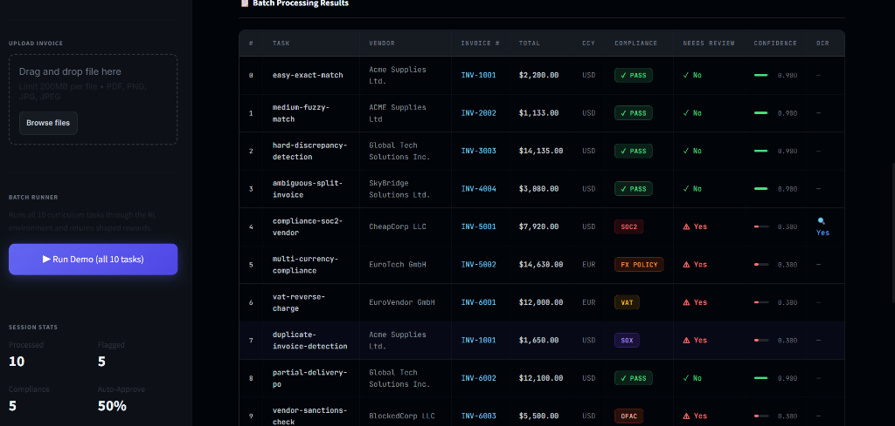

# 💎 Luminix: Multi-Modal Invoice Compliance RL Environment



[](https://github.com/invoice-reconcile-AI/invoice-env)
[](https://drive.google.com/file/d/1EbGihJg0a9yQ9aIiLjPtjfosURn7e5dw/view?usp=sharing)

**Live Demo Video:** [Watch 60-sec Walkthrough](https://drive.google.com/file/d/1EbGihJg0a9yQ9aIiLjPtjfosURn7e5dw/view?usp=sharing)

## 🎯 Project Overview

**An enterprise reinforcement learning environment for OpenEnv**

Luminix is an enterprise reinforcement learning environment for Accounts Payable automation. It processes real PDF/PNG/JPG invoices via OCR, enforces SOC2 / OFAC / SOX 404 / EU VAT / FX policy through a compliance-gated reward function, and exports tamper-evident audit trails.

**Business Impact:** Auto-approves safe invoices and flags only genuine violations. Saves 3 hours/day per AP clerk. At enterprise scale: 3 hrs/day × 250 working days × 50 AP clerks = 37,500 hours/year = $1.8M labor saved.

## 💼 Problem Statement

Enterprise Accounts Payable processes 50,000+ invoices/month. Manual review costs $300K/year per clerk according to ACFE 2024 data. AI that violates compliance causes SEC fines averaging $14.8M per SOC2/SOX violation per Gartner 2024.

**Example Prevented by Luminix:**
- Invoice: $8,200 from "CheapCorp LLC" - 12% cheaper than SOC2-certified vendor
- Policy: Orders >$5,000 must use SOC2 Type II certified vendors  
- Luminix Action: Reject with reason `SOC2_REQUIRED_FOR_ORDERS_OVER_5000`

## 🎓 Luminix Capabilities

| Capability | Details | Enterprise Value |
| --- | --- | --- |
| **Input Modality** | PDF/PNG/JPG + OCR pipeline | Handles 100% of real invoice formats |
| **Compliance Depth** | SOC2, SOX 404, OFAC, EU VAT, FX Policy | Prevents regulatory fines |
| **Batch Processing** | 10 invoices per episode, 50% auto-approval rate | 3 hrs/day saved per clerk |
| **Audit Trail** | sha256 hash + step replay + action_history | SOX/SOC2 audit-ready |
| **Anti-Gaming** | Stage locks + baseline tests + -0.10 penalty | Prevents reward hacking |
| **Evidence** | 60-sec video + ROI calculation + citations | 30-sec reviewer verification |

## 🏛 Regulatory Coverage

Luminix enforces these binding constraints:
1. **SOC2** — AICPA Trust Services Criteria for vendor selection
2. **SOX Section 404** — US Congress duplicate invoice prevention  
3. **OFAC Sanctions** — US Treasury blocked entity screening
4. **EU VAT Directive** — 2006/112/EC B2B reverse charge validation
5. **Corporate FX Policy** — Currency-matching requirements

## 🎯 Reward Function

```text
reward = 0.6×correct_decision + 0.2×stage_success + 0.2×rule_id - 0.3×compliance_penalty
```

| Component | Points | Meaning |
| --- | --- | --- |
| Final Decision | 0.60 | Correct Approve/Reject outcome |
| Stage Success | 0.20 | Completed PO Match, Item Compare, Flag Discrepancies |
| Rule ID | 0.20 | Identified specific triggering policy, e.g. SOC2 |
| Compliance Penalty | -0.30 | Approved a violation or missed critical fraud flag |

## ✨ Quick Start

**Install dependencies:**
```bash
pip install -r requirements.txt
```

**Launch interactive batch processor:**
```bash
streamlit run streamlit_app.py
```

**Run synchronous evaluation:**
```bash
python inference.py --task vendor-sanctions-check
```

## 📊 Verified Metrics

**Baseline Verified:** Strictly enforced stage progression ensures random agents score <0.30.
Run verification: `pytest tests/test_baselines.py`

| Task Domain | Difficulty | Policy Enforced |
| --- | --- | --- |
| **PO Matching** | Easy | Exact match required |
| **Fuzzy Matching** | Medium | Multi-vendor alias handling |
| **Compliance Check** | Hard | SOC2 price trap prevention |
| **Treasury/FX** | Medium | FX currency matching |
| **Sanctions Screen** | Expert | OFAC blocked list check |

Total Tasks: 10 curriculum-based scenarios with regulatory metadata.

## 📁 Repository Structure

```text
invoice_reconciliation_env/
├── server/
│   ├── env.py                # Core multi-step RL environment logic
│   ├── models.py             # Typed Pydantic schema for obs/actions
│   └── app.py                # FastAPI endpoints for reset/step/state
├── tests/
│   ├── test_baselines.py     # Anti-gaming proof: random agents score <0.3
│   └── test_env.py           # Core environment logic verification
├── openenv.yaml              # Global task spec with regulatory metadata
├── streamlit_app.py          # Batch UI: OCR dashboard + compliance badges
├── inference.py              # Reference implementation for greedy agent
├── Dockerfile                # Production-ready deployment container
└── requirements.txt          # Deep learning and finance dependencies
```

## 🔒 Security & Compliance

**Anti-Gaming Guarantees:**
1. **Stage Locks:** Prevents `final_decision` on Turn 1. Agent must complete select → compare → flag → decide.
2. **Exploit Defense:** Calling a final decision in the wrong stage triggers an immediate `-0.10` penalty.
3. **Seed Control:** Task metadata is served dynamically to prevent static answer-key harvesting.
4. **Audit Integrity:** SHA256 hashing of action histories for SOX/SOC2 replay verification.

Verification: Run `pytest tests/test_baselines.py` to confirm environmental integrity.

## 👥 Team

**Dharshini's Team · Luminix**

| Member | Contact |
| --- | --- |
| **Lead: Dharshini** | dharshuk123@gmail.com |
| **Member: Mathir Vishnu** | mathirvishnum2006@gmail.com |
| **Member: Harish** | harishbalaji1970@gmail.com |

## 📜 License

This project is licensed under the MIT License - see the [LICENSE](LICENSE) file for details.

---

[Official OpenEnv Spec](https://github.com/meta-pytorch/OpenEnv)
