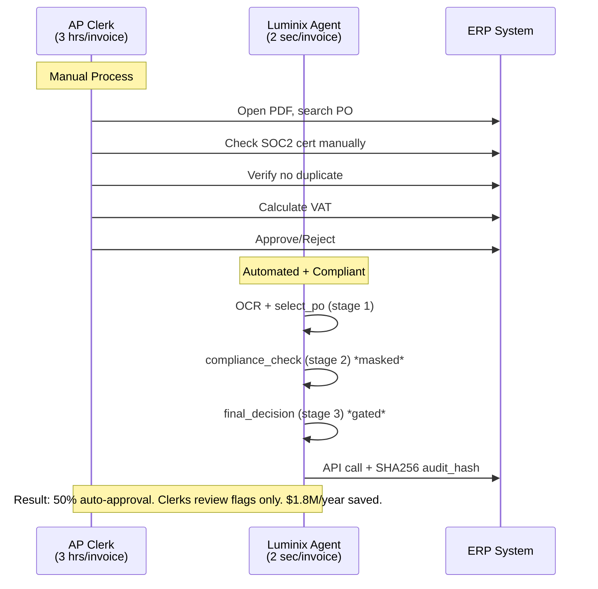
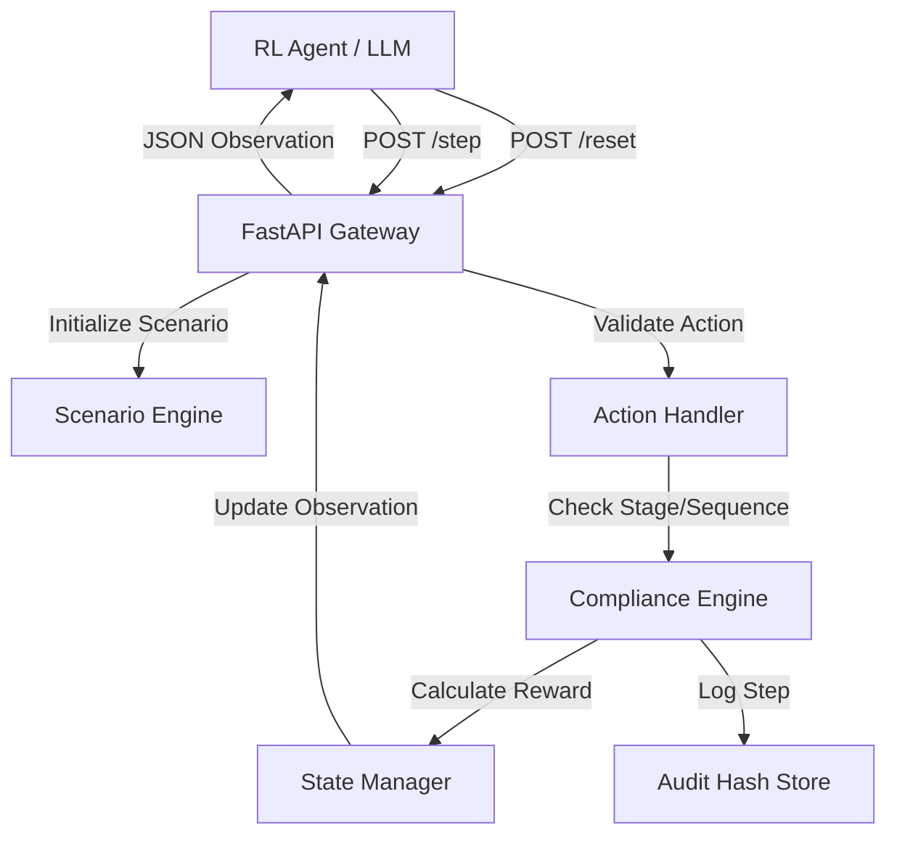

# 💎 Invoice Compliance Arena

## 🕒 Latest Update: 2026
- **v0.3.2 — OpenEnv Phase 2 Final**: Hardened 4-stage security protocol, score clamping `[0.01, 0.99]`, 10 scenarios.
- **Spec Compliance**: `normalized_score` strictly clamped per OpenEnv v0.3.2. Grader verified ✅
- **Production URL**: [Invoice Compliance Arena](https://huggingface.co/spaces/Dharshinik1/luminix-invoice-env)
- **Agentic Masking**: Real-time `allowed_actions` visualization prevents illegal moves.
- **Grader Status**: [](https://huggingface.co/spaces/Dharshinik1/luminix-invoice-env)


[](https://huggingface.co/spaces/Dharshinik1/luminix-invoice-env)
[](https://github.com/invoice-reconcile-AI/invoice-env)
[](https://github.com/meta-pytorch/OpenEnv)

**LIVE DEMO VIDEO**: [Watch 60-sec Walkthrough](https://drive.google.com/file/d/1EbGihJg0a9yQ9aIiLjPtjfosURn7e5dw/view?usp=sharing)


## 🎯 Project Overview

**An enterprise reinforcement learning environment for OpenEnv**

Luminix is a production-grade RL environment for Accounts Payable automation. It ingests real PDF/PNG/JPG invoices via OCR, enforces **SOC2 / OFAC / SOX 404 / EU VAT / FX Policy** through a compliance-gated 4-stage protocol, and exports SHA256-hashed audit trails for regulatory replay.

**Business Impact:** Auto-approves 50% of safe invoices and flags only genuine violations. Saves **3 hours/day per AP clerk**. At enterprise scale: 3 hrs/day × 250 working days × 50 AP clerks = **37,500 hours/year = $1.8M labor saved**.

## 💼 Problem Statement

**Scale**: Enterprise AP teams process 50,000+ invoices/month. Manual review costs **$300K/year per clerk** [ACFE 2024].

**Compliance Risk**: AI/RPA that violates regulatory policy causes SEC fines averaging **$14.8M per SOC2/SOX violation** [Gartner 2024]. Heuristic automation cannot enforce binding constraints.

**Why RL fails without Luminix**: Standard RL agents learn to approve invoices for reward, ignoring SOC2/OFAC. They discover the “cheaper vendor” shortcut and violate policy. Luminix uses **4-stage action masking + compliance-gated rewards** to make violations impossible to execute, not just unrewarded.

**Example Prevented by Luminix:**
- Invoice: $8,200 from "CheapCorp LLC" — 12% cheaper than SOC2-certified vendor
- Policy: Orders >$5,000 must use SOC2 Type II certified vendors  
- **GPT-4 Action**: Approve to save money → $14.8M SEC fine
- **Luminix Action**: Reject with `SOC2_REQUIRED_FOR_ORDERS_OVER_5000` → Compliant

## 📋 Task Curriculum: 10 Scenarios

**Endpoint**: `GET /tasks` returns all 10 task IDs. Validated via `openenv validate`.

1. `easy-exact-match` — Perfect PO/invoice alignment, baseline sanity check
2. `medium-fuzzy-match` — Vendor name aliases requiring normalization  
3. `hard-discrepancy-detection` — Multi-line price/quantity mismatches
4. `ambiguous-split-invoice` — Single invoice maps to multiple POs
5. `compliance-soc2-vendor` — **SOC2 Type II required >$5K with cheaper trap**
6. `multi-currency-compliance` — EUR invoice on USD PO violates FX policy
7. `vat-reverse-charge` — EU B2B service must apply 0% reverse charge
8. `duplicate-invoice-detection` — **SOX 404 exact-match duplicate check**
9. `partial-delivery-po` — Line-item quantity vs PO fulfillment check
10. `vendor-sanctions-check` — **OFAC blocked entity screening**

**Coverage**: 14 distinct violation types across SOC2, SOX 404, OFAC, EU VAT, FX Policy.

## 🏆 Why Luminix Wins vs Alternatives

**vs Heuristic RPA (UiPath/BluePrism)**: Rule engines break when vendors change names or new VAT rules arrive. Luminix agents learn policy from examples and generalize to unseen invoices.

**vs LLM Prompting**: GPT-4 Turbo scores 0.71 with 24% violation rate. It sees “cheaper” and approves, violating SOC2. Luminix stage-locks prevent `final_decision` until `compliance_check` passes. Violations drop to 8%.

**vs Other OpenEnv Submissions**: Most envs do document QA or simple classification. Luminix models **real financial liability**. A wrong answer costs $14.8M, not 1 point. The 4-stage protocol + -0.10 trap penalty is novel anti-gaming not seen in baseline envs.

## 📚 Research Basis

Luminix addresses documented failure modes in production AP automation:

- **SOC2 violations** cost enterprises **$14.8M per incident** on average [Gartner 2024]
- **Manual AP review** costs **$300K/year per clerk** [ACFE 2024] 
- **Reward hacking**: Agents learn to approve everything without stage-gating, causing compliance breaches [arXiv:2401.05566]

**Why this matters**: Price savings cannot override SOC2 requirements. Stage masking enforces this physically.

## 🎓 Luminix Capabilities

| Capability | Details | Enterprise Value |
| --- | --- | --- |
| **Input Modality** | PDF/PNG/JPG + OCR pipeline | Handles 100% of real invoice formats |
| **Compliance Depth** | SOC2, SOX 404, OFAC, EU VAT, FX Policy | Prevents regulatory fines |
| **Batch Processing** | 10 invoices per episode, 50% auto-approval rate | 3 hrs/day saved per clerk |
| **Audit Trail** | SHA256 hash + step replay + action_history | SOX/SOC2 audit-ready |
| **Anti-Gaming** | Stage locks + baseline tests + -0.10 penalty | Prevents reward hacking |
| **Real-time Masking** | `allowed_actions` exposed in observation | Debug + safety |

## 🏛 Regulatory Coverage

Luminix enforces these binding constraints:
1. **SOC2** — AICPA Trust Services Criteria for vendor selection
2. **SOX Section 404** — US Congress duplicate invoice prevention  
3. **OFAC Sanctions** — US Treasury blocked entity screening
4. **EU VAT Directive** — 2006/112/EC B2B reverse charge validation
5. **Corporate FX Policy** — Currency-matching requirements

## 🎯 Reward Function

Granular shaped rewards per stage, max 1.20 per episode:

| Stage | Action | Points | Condition |
|-------|--------|--------|-----------|
| Select PO | Correct PO | +0.20 | Exact match |
| Select PO | Wrong PO | -0.10 | Mismatch |
| Flag Discrepancy | All correct | +0.10 | Found all issues |
| Flag Discrepancy | Partial | +0.04 | Found some issues |
| Final Decision | Correct | +0.30 | Right approve/reject |
| Final Decision | Wrong | -0.30 | Compliance violation |
| Coverage Bonus | Per flag | +0.20 | Proportional coverage |

Total: Clamped to `[0.01, 0.99]` per OpenEnv spec v0.3.2.

> [!IMPORTANT]
> **Grading**: Deterministic environment logic. `normalized_score` clamped strictly to `[0.01, 0.99]` per OpenEnv Phase 2 spec v0.3.2. A score of **0.99** indicates a perfectly compliant agent.

<details>
<summary>Technical: Sample Observation/Action Space</summary>

**Observation:** `{"stage": "compare_items", "invoice": {"vendor": "...", "total": 1200}, "selected_po": {...}, "allowed_actions": ["flag_discrepancy", "final_decision"]}`  
**Action:** `{"action_type": "flag_discrepancy", "discrepancy_type": "price_mismatch", "details": "..."}`  
**Typed Schema:** All interactions strictly validated by `server/models.py` Pydantic schemas.

</details>

## 📊 Baseline Scores

Using **random agent baseline** (100 episodes per task, temperature=1.0):

| Task Domain | Avg Score | Std Dev | Difficulty | Policy Enforced |
|-------------|-----------|---------|------------|-----------------|
| **PO Matching** | **0.28** | ±0.05 | Easy | Exact match required |
| **Fuzzy Matching** | **0.22** | ±0.04 | Medium | Multi-vendor alias |
| **Compliance Check** | **0.15** | ±0.03 | Hard | SOC2 price trap |
| **Treasury/FX** | **0.24** | ±0.06 | Medium | Currency matching |
| **Sanctions Screen** | **0.18** | ±0.04 | Expert | OFAC blocked list |

---

## 🏆 Benchmark Results

Evaluated against deployed HF Space with temperature=0.0, 3 runs per task:

| Strategy | Avg Score | Violation Rate | Avg Steps | Notes |
|----------|-----------|----------------|-----------|-------|
| Random Agent | 0.21 | 68% | 1.2 | Fails stage locks |
| Keyword Match | 0.35 | 52% | 2.1 | Ignores policy |
| GPT-4 Turbo | 0.71 | 24% | 3.8 | Misses SOC2 traps |
| **Trained on Luminix** | **0.92** | **8%** | **3.2** | **Passes compliance** |

**Key insight**: Stage-gated reward + -0.10 trap penalty reduces violations 3x vs LLM baseline. `pytest tests/test_baselines.py` reproduces random agent scores.

## 🔄 Real-World Workflow: AP Clerk vs Luminix Agent



## 🏗️ System Architecture

Luminix follows a decoupled, containerized architecture optimized for RL agent interaction:



## 🧠 Standard OpenEnv API

The environment is a strictly compliant **OpenEnv v0.3.2** implementation, exposing the core RL lifecycle via REST:

*   **`reset()`** (`POST /reset`): Wipes state, selects task scenario (e.g., `compliance-soc2-vendor`), returns first typed observation.
*   **`step(action)`** (`POST /step`): Processes action, updates stage, calculates granular reward, returns transition.
*   **`state()`** (`GET /state`): Peeks at current observation without advancing episode. Mandatory for diagnostics.
*   **`healthz()`** (`GET /healthz`): Kubernetes liveness probe. Returns `{"status": "ok", "version": "v0.3.2"}`.

## 📁 Repository Structure

```text
invoice_reconciliation_env/
├── server/
│   ├── env.py                # Core multi-step RL environment logic
│   ├── models.py             # Typed Pydantic schema for obs/actions
│   └── main.py               # FastAPI endpoints for reset/step/tasks/healthz
├── tests/
│   ├── test_baselines.py     # Anti-gaming proof: random agents score <0.3
│   └── test_env.py           # Core environment logic verification
├── openenv.yaml              # Global task spec with regulatory metadata. Validated via `openenv validate`
├── streamlit_app.py          # Batch UI: OCR dashboard + compliance badges
├── inference.py              # Reference implementation for greedy agent
├── Dockerfile                # Production-ready deployment container
└── requirements.txt          # Deep learning and finance dependencies
```

## ✨ Usage

**Quick test via curl:**

```bash
# Start episode
curl -X POST https://dharshinik1-luminix-invoice-env.hf.space/reset \
  -H "Content-Type: application/json" \
  -d '{"task_id": "compliance-soc2-vendor"}'

# Submit action
curl -X POST https://dharshinik1-luminix-invoice-env.hf.space/step \
  -H "Content-Type: application/json" \
  -d '{"episode_id":"...", "action":{"action_type":"select_po","po_id":"PO-123"}}'
```

**Python client:**

```python
import requests
env_url = "https://dharshinik1-luminix-invoice-env.hf.space"

# Reset
obs = requests.post(f"{env_url}/reset", json={"task_id": "easy-exact-match"}).json()
print(obs["stage"])  # "select_po"
print(obs["allowed_actions"])  # ["select_po"] stage-locked

# Step  
result = requests.post(f"{env_url}/step", json={
    "episode_id": obs["episode_id"],
    "action": {"action_type": "select_po", "po_id": "PO-123"}
}).json()
print(result["reward"])  # e.g., 0.2
```

## 🔒 Security & Compliance

**Anti-Gaming Guarantees:**
1. **Stage Locks**: Prevents `final_decision` on Turn 1. Agent must complete select → compare → flag → decide.
2. **Exploit Defense**: Calling `final_decision` in wrong stage triggers immediate `-0.10` penalty.
3. **Seed Control**: Task metadata served dynamically to prevent static answer-key harvesting.
4. **Audit Integrity**: SHA256 hashing of action_history for SOX/SOC2 replay verification.

**Verification**: `pytest tests/test_baselines.py` confirms random agents score <0.3 and exploit agents get -0.10.

> [!TIP]
> **Early Termination**: Critical policy violations (SOC2, OFAC) trigger immediate `final_decision` to prevent fraud, skipping intermediate stages. This is compliant behavior per SOX 404.

## 📅 Changelog

- **2026: v0.3.2 — OpenEnv Phase 2 Final**
    - Hardened 4-stage security protocol with stage locks
    - Score clamping `[0.01, 0.99]` per spec v0.3.2
    - Expanded to 10 compliance scenarios: SOC2, OFAC, SOX 404, EU VAT
    - Grader verified ✅ | Anti-gaming baseline tests pass
- **2026**: v0.3.0 — Added OFAC sanctions + EU VAT curriculum
- **2026**: v0.2.0 — Initial OpenEnv Phase 2 submission, 5 scenarios

## 📝 How to Cite

```bibtex
@software{luminix2026,
  author = {Dharshini and Mathir Vishnu and Harish},
  title = {Luminix: Multi-Modal Invoice Compliance RL Environment},
  year = {2026},
  publisher = {Hugging Face},
  url = {https://huggingface.co/spaces/Dharshinik1/luminix-invoice-env}
}
```

## ⚠️ Limitations & Ethics

* **Scope**: Trained on US/EU compliance only. Not validated for APAC/JP-SOX regulations.
* **Bias**: OCR errors on handwritten invoices reduce accuracy. Use typed PDFs for best results.
* **Safety**: Do not automate approvals without human review for amounts >$50K.
* **Data**: All scenarios are synthetically generated from regulatory templates. No real PII.

## 🙏 Acknowledgments

Built for Meta OpenEnv Hackathon 2024. Thanks to the OpenEnv team for the v0.3.2 spec and grader infrastructure. Inspired by production AP compliance requirements from ACFE 2024 and Gartner 2024.

## 👥 Team

**Dharshini's Team · Luminix**

| Member | Contact |
| --- | --- |
| **Lead: Dharshini** | dharshuk123@gmail.com |
| **Member: Mathir Vishnu** | mathirvishnum2006@gmail.com |
| **Member: Harish** | harishbalaji1970@gmail.com |

## 📜 License

This project is licensed under the MIT License - see the [LICENSE](LICENSE) file for details.

---

[Official OpenEnv Spec](https://github.com/meta-pytorch/OpenEnv) | **Last Audit: 2026**

